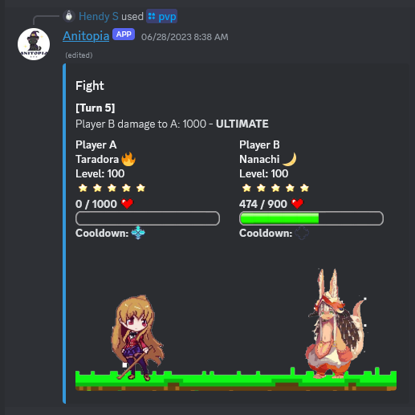

# Anitopia Project

    
        Anitopia is a text-based anime RPG Discord bot, as the name suggests. It operates on a turn-based RPG system with a variety of character classes. You collect your own characters, create teams of characters, and go on adventures or challenge other players to battles. Each character has their own unique abilities and personality, just like in the anime they're based on. It's all about strategy and having fun in this turn-based RPG game!
    
    
        
    

## About
This is one of the BEST projects I've ever made. After much consideration, I've decided to open up the Anitopia Project. Though it remains unfinished, I'm releasing it publicly since I haven't been actively developing it for some time now. As a solo developer, the complexities of the project grew, demanding more resources and time than I could feasibly manage alone. Also, I haven't found others who share the same passion to collaborate with on this project. If you're reading this and interested in collaborating on the project, feel free to reach out. I'm happy to discuss more about it, since I have tons of ideas that haven't been executed yet for this project.

## Features
This bot uses slash commands as its instruction. The available commands include:

- `/main`: This is where all main commands of the bot are listed.
- `/summon`: This is where you summon your character. You get 1 free novice scroll summon every day.
- `/character`: To check your character collection. I've maximized the user experience features, so you will find some features that have not been implemented by other bots.
- `/profile`: To customize your in-game account profile.
- `/duel {user}`: To do a duel battle with other people.
- `/ping`: To check your connection latency.

And much more... _(todo: much more commands and features will be added in the future)_

## Demo
Watch the bot demo below:
~ video to be added

## Installation
I won't give a detailed instruction on how to replicate or use the project running your machine locally since it's a bit complex to set up. But, I will say to make sure you have redis-server installed and running on your system, a MongoDB server URI, your own discord server, and a discord bot application that you can create in Discord Developer Portal. To proceed, copy the `config-example.json` and `.env-example` files and adjust them with your own credentials.

## License
MIT
