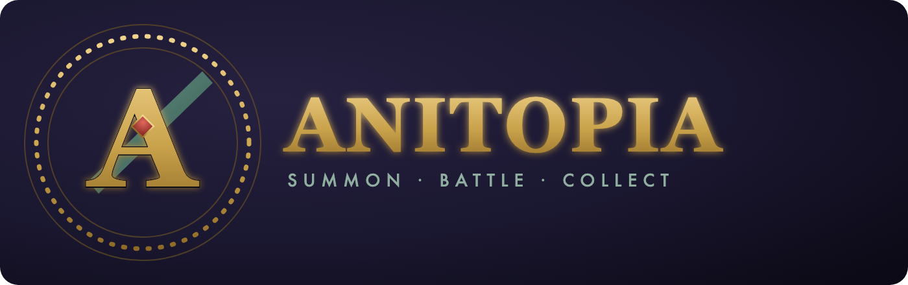

**Anitopia** is a turn-based anime gacha-RPG Discord bot. Summon characters from your favorite anime,
build a team, and battle, either against another player or a random AI-controlled squad. Every
character has a class, an element, and a passive + active skill, all rendered in a hand-built
pixel-art battle scene.

This is an old personal project I picked back up, using AI assistance (Claude Code) to brainstorm the
game design and help build it out. It's **unfinished, not a polished v1, but stable enough to demo**:
the core loop (register, summon, build a team, duel/battle) runs end-to-end without crashing. See
[Project status](#project-status) below for what's solid and what's still rough.

## Demo

[Watch the demo](media/demo.mp4)

<!--
For an inline player instead of a download link: open this README in the GitHub web editor after
pushing, drag media/demo.mp4 into this section, and GitHub will replace it with its own hosted
player link (that link can only be generated through the web UI, not from the command line).
-->

## Features

- **5 character classes** (Warrior, Mage, Tank, Hunter, Support), each with a distinct combat hook
- **8-element type wheel** (Pyro, Aqua, Volt, Terra, Aero, Lumen, Shade, Neutralis) with real
  advantage/disadvantage multipliers
- **Gacha summoning** with per-scroll rarity tables and a pity system
- **Leveling**, passive/active skills, and a full status-effect system (Bleed, Poison, Burn,
  Paralysis, Freeze, Sleep, Silence, buffs/debuffs, and more)
- **PvP duels** against other players and **PvE battles** against AI squads
- A weekly-rotating Featured Series summon scroll

See [`design-docs/GAME-MECHANICS-GUIDE.md`](design-docs/GAME-MECHANICS-GUIDE.md) for the full
breakdown of how the numbers work, and [`design-docs/GAME-DESIGN-PLAN.md`](design-docs/GAME-DESIGN-PLAN.md)
for the roadmap.

## Commands

| Command | Description |
|---|---|
| `/main` | Central menu for the bot's main features |
| `/register` | Create your Anitopia player profile |
| `/summon` | Summon a character (1 free Novice scroll every day) |
| `/character` | Manage your collection, build teams, and enhance characters |
| `/info {character-id}` | Look up a character's stats, rarity, and skills |
| `/team` | Set up your active battle team |
| `/duel {user}` | Challenge another player to a PvP duel |
| `/battle` | Battle a random AI-controlled team |
| `/profile` | Customize your in-game profile |
| `/ping` | Check bot latency |

## Project status

This is a personal/portfolio project, not a production release. It's good enough to demo the core
gameplay loop end-to-end, but it's not feature-complete and hasn't seen real user load.

**Solid enough to demo:**
- Register → summon → collection → team setup → `/duel` and `/battle` all work start to finish
- Turn-based battle engine with class hooks, elemental type wheel, and a full status-effect system
- Hand-built pixel-art battle UI with a paginated replay viewer
- 18-character roster with real skill data (not placeholder text)

**Known rough edges:**
- Roster is small (18 characters) and class/rarity distribution isn't fully balanced; see
  `design-docs/GAME-DESIGN-PLAN.md` for the plan to grow it
- Story mode is a stub (`/main` -> Story just says "not built yet")
- `pnpm run seed` always inserts, so re-running it against an already-seeded database will duplicate
  data rather than upsert; only run it once per fresh database
- No automated test suite yet; correctness has been verified through manual and scripted playtesting
- This was originally solo-built and is now being extended with AI assistance, so code style/patterns
  aren't fully consistent across older and newer files

## Setup

**Requirements:**
- [Node.js](https://nodejs.org/) + [pnpm](https://pnpm.io/)
- A running [MongoDB](https://www.mongodb.com/) instance (local or Atlas)
- A running local [Redis](https://redis.io/) server
- A Discord bot application (create one at the [Discord Developer Portal](https://discord.com/developers/applications))

**Steps:**

1. Clone the repo and install dependencies:
   ```
   pnpm install
   ```
2. Copy the example config files and fill in your own credentials:
   ```
   cp .env-example .env
   cp config-example.json config.json
   ```
   `.env` needs your bot's token and MongoDB connection URI. `config.json` needs your bot's client ID,
   a Discord server ID to use for testing (`testOnly` commands register there instantly instead of
   waiting on Discord's global command propagation), and your own Discord user ID (`devs`) to unlock
   dev-only commands.
3. Seed the database with the initial character/skill data:
   ```
   pnpm run seed
   ```
4. Start the bot:
   ```
   pnpm run dev
   ```

## License

MIT
